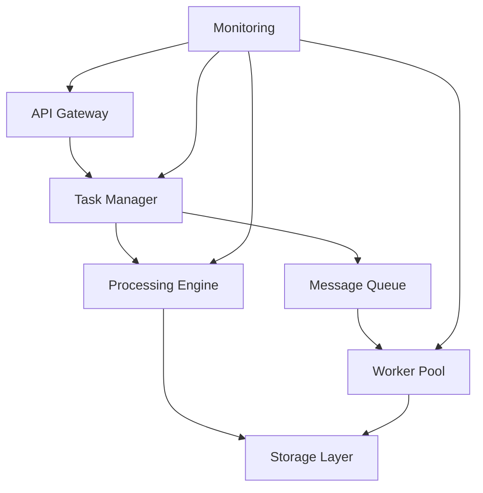

# Data Processing Pipeline

[](https://github.com/organization/repo/actions)
[](https://codecov.io/gh/organization/repo)
[](LICENSE)
[](https://status.organization.com)

A cloud-based automation platform for streamlined data collection, processing, and structuring from web scraping and OCR tasks.

## Project Overview

### Executive Summary
The Data Processing Pipeline is an enterprise-grade automation platform that enables:
- Automated web scraping and OCR data collection
- Standardized data processing workflows
- Structured data storage and retrieval
- RESTful API access
- Comprehensive monitoring and logging

### Key Features
- High-performance web scraping engine
- Advanced OCR processing capabilities
- Cloud-native architecture
- Scalable task processing
- Enterprise security controls
- Comprehensive API access

### Technology Stack
- **Runtime**: Python 3.11+
- **API Framework**: FastAPI 0.100+
- **Web Scraping**: Scrapy 2.9+
- **OCR Engine**: Tesseract 4.1+
- **Cloud Platform**: Google Cloud Platform
- **Container Orchestration**: Google Kubernetes Engine
- **Message Queue**: Cloud Pub/Sub
- **Storage**: Google Cloud Storage, Cloud Firestore

## Getting Started

### Prerequisites
- Python 3.11+
- Docker and Docker Compose
- Google Cloud SDK
- Git

### Installation

```bash
git clone https://github.com/organization/repo.git
cd repo
pip install -r requirements.txt
```

### Local Development Setup

```bash
docker-compose -f src/backend/docker-compose.yml up -d
```

### Configuration

```yaml
api:
  base_url: https://api.example.com
  version: v1
  timeout: 30
security:
  api_key_rotation: 90
  encryption_algorithm: AES-256-GCM
```

## System Architecture

### High-Level Design


### Component Interactions
- **API Gateway**: Handles authentication, rate limiting, and request routing
- **Task Manager**: Orchestrates task scheduling and execution
- **Processing Engine**: Implements scraping and OCR logic
- **Storage Layer**: Manages data persistence and retrieval
- **Worker Pool**: Executes distributed processing tasks
- **Monitoring**: Provides system observability and alerting

## API Documentation

### Authentication
```python
import requests

api_key = 'your_api_key'
headers = {'Authorization': f'Bearer {api_key}'}
response = requests.get('https://api.example.com/v1/tasks', headers=headers)
```

### Endpoints
- `POST /api/v1/tasks`: Create new processing task
- `GET /api/v1/tasks/{id}`: Retrieve task status
- `GET /api/v1/data`: List available processed data
- `GET /api/v1/status`: System health check

## Security

### Authentication & Authorization
- API key-based authentication
- Role-based access control (RBAC)
- Token rotation policies
- Request signing and validation

### Data Protection
- TLS 1.3 encryption in transit
- AES-256-GCM encryption at rest
- Key management through Cloud KMS
- Regular security audits

## Development

### Code Standards
- PEP 8 compliance
- Type hints required
- Comprehensive documentation
- Unit test coverage >80%

### CI/CD Pipeline
- Automated testing
- Code quality checks
- Container security scanning
- Zero-downtime deployments

## Operations

### Monitoring
- Real-time performance metrics
- Error tracking and alerting
- Resource utilization monitoring
- Custom business metrics

### Scaling Guidelines
- Horizontal pod autoscaling
- Queue-based load management
- Resource quotas and limits
- Regional failover support

## Contributing
Please read [CONTRIBUTING.md](CONTRIBUTING.md) for details on our code of conduct and the process for submitting pull requests.

## License
This project is licensed under the MIT License - see the [LICENSE](LICENSE) file for details.

## Support
- Documentation: [docs.example.com](https://docs.example.com)
- API Status: [status.example.com](https://status.example.com)
- Issue Tracker: [GitHub Issues](https://github.com/organization/repo/issues)

---
Last Updated: 2024-01-19  
Version: 2.0.0  
Maintainers: Development Team, Security Team, Operations Team