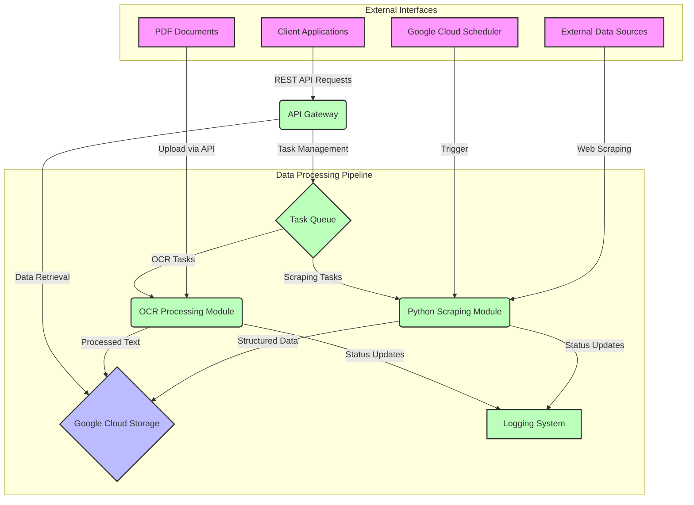
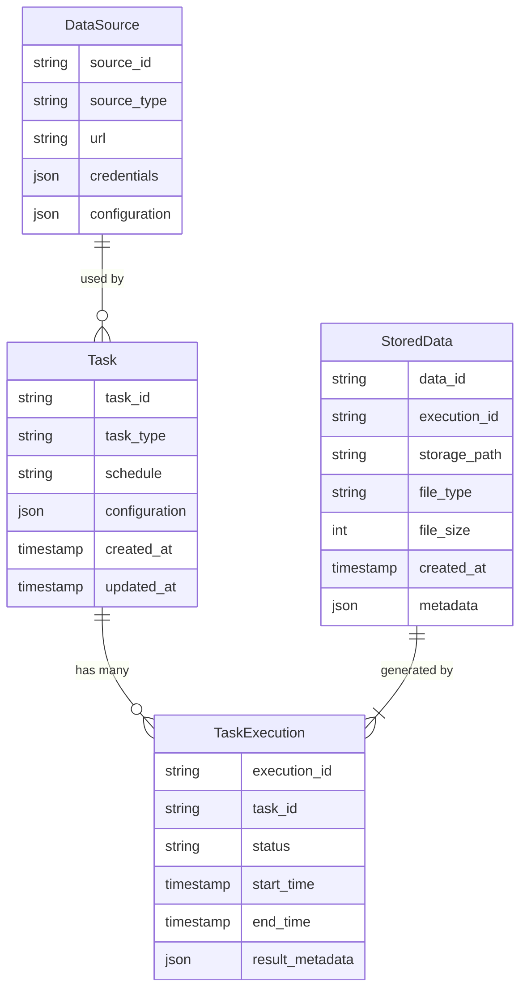
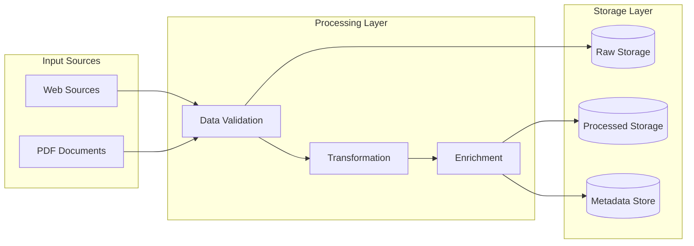
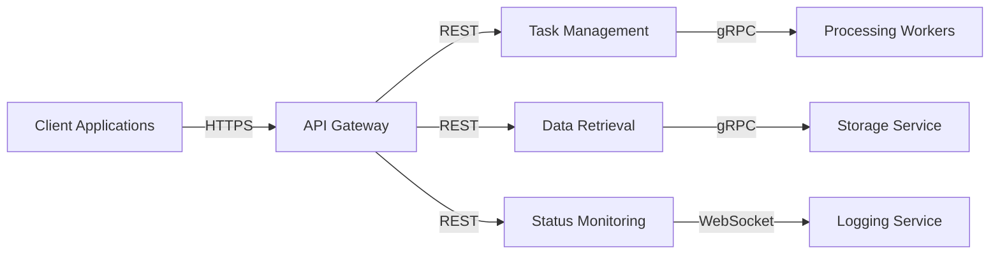
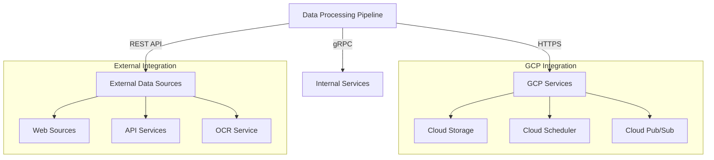

# Product Requirements Document (PRD)

# 1. INTRODUCTION

## 1.1 Purpose

This Software Requirements Specification (SRS) document provides a comprehensive description of the Data Processing Pipeline system - a cloud-based platform for automated web scraping and OCR processing. The document is intended for:

- Development team members implementing the system
- Project stakeholders reviewing technical requirements
- System administrators managing the deployed solution
- Future maintainers of the codebase

## 1.2 Scope

The Data Processing Pipeline system is a backend-focused automation platform that handles routine data collection, processing, and storage tasks. The system encompasses:

### 1.2.1 Core Capabilities
- Automated web scraping with configurable schedules
- PDF document processing via OCR
- Structured data storage in Google Cloud Storage
- RESTful APIs for data retrieval and task management

### 1.2.2 Key Benefits
- Eliminates manual data collection processes
- Provides programmatic access to structured datasets
- Scales easily to handle multiple data sources
- Maintains data consistency and reliability

### 1.2.3 System Boundaries
The system includes:
- Python-based scraping framework
- OCR processing engine
- Google Cloud Storage integration
- REST API endpoints
- Task scheduling and monitoring

The system excludes:
- Frontend user interface
- Data analysis tools
- Direct database querying capabilities
- Real-time data streaming

# 2. PRODUCT DESCRIPTION

## 2.1 Product Perspective
The Data Processing Pipeline system operates as a standalone backend service within the Google Cloud Platform ecosystem. It interfaces with:

- Google Cloud Storage for data persistence
- Google Cloud Scheduler for task automation
- External websites and APIs for data collection
- Client applications via RESTful APIs
- OCR processing services for document analysis

## 2.2 Product Functions
The system provides the following core functions:

| Function Category | Key Capabilities |
|------------------|------------------|
| Web Scraping | - Scheduled automated data collection<br>- Support for multiple data sources<br>- Configurable scraping parameters<br>- Structured data extraction |
| OCR Processing | - PDF document ingestion<br>- Text extraction and structuring<br>- Multi-page document support<br>- Error handling and validation |
| Data Storage | - Cloud-based file management<br>- Structured data organization<br>- Metadata tracking<br>- Version control |
| API Access | - RESTful endpoint exposure<br>- Task management interfaces<br>- Data retrieval services<br>- Status monitoring |

## 2.3 User Characteristics

| User Type | Characteristics | Technical Expertise | Usage Patterns |
|-----------|----------------|---------------------|----------------|
| Data Engineers | - Build data pipelines<br>- Manage data flows | High technical proficiency with Python and APIs | Regular system configuration and monitoring |
| Developers | - Integrate with APIs<br>- Retrieve processed data | Moderate to high programming skills | Periodic API interactions |
| Data Scientists | - Access structured datasets<br>- Analyze processed data | Strong analytical skills, basic API knowledge | Regular data consumption |

## 2.4 Constraints

### 2.4.1 Technical Constraints
- Limited to Python-based scraping implementations
- Google Cloud Platform dependency
- API rate limits from external data sources
- OCR accuracy limitations for poor quality documents

### 2.4.2 Business Constraints
- No user interface development
- Focus on backend automation
- Budget limitations for cloud resources
- Compliance with data collection regulations

## 2.5 Assumptions and Dependencies

### 2.5.1 Assumptions
- Stable internet connectivity for web scraping
- Consistent data source formats
- Sufficient cloud resources availability
- Regular maintenance windows

### 2.5.2 Dependencies
- Google Cloud Platform services
- External website/API availability
- OCR processing service reliability
- Python package ecosystem stability

# 3. PROCESS FLOWCHART



# 4. FUNCTIONAL REQUIREMENTS

## 4.1 Web Scraping Module (WSM)

### ID: WSM-001
### Description
Core web scraping functionality to automatically collect data from configured sources
### Priority
High
### Requirements

| ID | Requirement | Priority |
|---|-------------|----------|
| WSM-001.1 | Execute scheduled scraping tasks via Google Cloud Scheduler | High |
| WSM-001.2 | Support multiple concurrent scraping tasks | High |
| WSM-001.3 | Store structured data (JSON/CSV) in Google Cloud Storage | High |
| WSM-001.4 | Implement modular scraping scripts using Python | High |
| WSM-001.5 | Handle rate limiting and retry mechanisms | Medium |
| WSM-001.6 | Support custom scraping configurations per data source | Medium |

## 4.2 OCR Processing Module (OPM)

### ID: OPM-001
### Description
PDF document processing and text extraction functionality
### Priority
High
### Requirements

| ID | Requirement | Priority |
|---|-------------|----------|
| OPM-001.1 | Accept PDF uploads via REST API | High |
| OPM-001.2 | Process multi-page PDF documents | High |
| OPM-001.3 | Extract and structure text content | High |
| OPM-001.4 | Store OCR results in Google Cloud Storage | High |
| OPM-001.5 | Handle poor quality document processing | Medium |
| OPM-001.6 | Support batch processing of multiple PDFs | Low |

## 4.3 Data Storage Module (DSM)

### ID: DSM-001
### Description
Cloud storage management and data organization functionality
### Priority
High
### Requirements

| ID | Requirement | Priority |
|---|-------------|----------|
| DSM-001.1 | Create and manage GCS bucket structure | High |
| DSM-001.2 | Implement metadata tracking for stored files | High |
| DSM-001.3 | Support version control for stored data | Medium |
| DSM-001.4 | Implement data lifecycle management | Medium |
| DSM-001.5 | Provide secure access controls | High |
| DSM-001.6 | Enable data backup and recovery | Medium |

## 4.4 API Module (APM)

### ID: APM-001
### Description
RESTful API endpoints for system interaction
### Priority
High
### Requirements

| ID | Requirement | Priority |
|---|-------------|----------|
| APM-001.1 | Expose endpoints for task management | High |
| APM-001.2 | Implement data retrieval endpoints | High |
| APM-001.3 | Provide status monitoring endpoints | High |
| APM-001.4 | Support API key authentication | High |
| APM-001.5 | Implement rate limiting | Medium |
| APM-001.6 | Version API endpoints | Medium |

## 4.5 Logging Module (LGM)

### ID: LGM-001
### Description
System-wide logging and monitoring functionality
### Priority
Medium
### Requirements

| ID | Requirement | Priority |
|---|-------------|----------|
| LGM-001.1 | Track task execution status | High |
| LGM-001.2 | Record detailed error logs | High |
| LGM-001.3 | Monitor system performance metrics | Medium |
| LGM-001.4 | Generate task completion reports | Medium |
| LGM-001.5 | Implement log rotation and archival | Low |
| LGM-001.6 | Support log querying and filtering | Medium |

# 5. NON-FUNCTIONAL REQUIREMENTS

## 5.1 Performance Requirements

| Requirement ID | Description | Target Metric |
|---------------|-------------|---------------|
| PERF-001 | API Response Time | 95% of API requests must complete within 500ms |
| PERF-002 | Web Scraping Throughput | Process minimum 100 pages per minute per scraper |
| PERF-003 | OCR Processing Speed | Complete single PDF processing within 2 minutes |
| PERF-004 | Concurrent Task Handling | Support 50 simultaneous scraping/OCR tasks |
| PERF-005 | Storage I/O Performance | Achieve 100MB/s read/write speeds with GCS |
| PERF-006 | Memory Usage | Maximum 2GB RAM per worker process |

## 5.2 Safety Requirements

| Requirement ID | Description | Implementation |
|---------------|-------------|----------------|
| SAFE-001 | Data Backup | Daily automated backups of all stored data |
| SAFE-002 | Failure Recovery | Automatic task retry with exponential backoff |
| SAFE-003 | System State Preservation | Transaction logging for all data modifications |
| SAFE-004 | Resource Monitoring | Automated alerts for resource exhaustion |
| SAFE-005 | Data Corruption Prevention | Checksum verification for all stored files |
| SAFE-006 | Graceful Degradation | Maintain core functions during partial system failure |

## 5.3 Security Requirements

| Requirement ID | Description | Implementation |
|---------------|-------------|----------------|
| SEC-001 | Authentication | API key-based authentication for all endpoints |
| SEC-002 | Authorization | Role-based access control for different API operations |
| SEC-003 | Data Encryption | AES-256 encryption for data at rest in GCS |
| SEC-004 | Transport Security | TLS 1.3 for all API communications |
| SEC-005 | Audit Logging | Detailed logs of all system access and operations |
| SEC-006 | Rate Limiting | Maximum 1000 requests per hour per API key |

## 5.4 Quality Requirements

### 5.4.1 Availability
- System uptime of 99.9% excluding planned maintenance
- Maximum planned downtime of 4 hours per month
- Automatic failover for critical components

### 5.4.2 Maintainability
- Modular architecture with clear separation of concerns
- Comprehensive API documentation
- Automated deployment scripts
- Code coverage minimum 80%

### 5.4.3 Usability
- RESTful API following OpenAPI 3.0 specification
- Consistent error response format
- Clear activity status reporting
- Detailed API documentation with examples

### 5.4.4 Scalability
- Horizontal scaling support for processing workers
- Auto-scaling based on queue size
- Support for distributed task processing
- Linear performance scaling up to 1000 concurrent users

### 5.4.5 Reliability
- Maximum 0.1% error rate for API requests
- Automated error recovery for failed tasks
- Data consistency verification after processing
- Regular system health checks

## 5.5 Compliance Requirements

| Requirement ID | Description | Standard/Regulation |
|---------------|-------------|-------------------|
| COMP-001 | Data Privacy | GDPR compliance for personal data handling |
| COMP-002 | Data Retention | Implement configurable retention policies |
| COMP-003 | Audit Trail | Maintain detailed logs for 90 days |
| COMP-004 | API Standards | Follow REST API best practices |
| COMP-005 | Cloud Security | Comply with GCP security standards |
| COMP-006 | Data Protection | Implement data loss prevention measures |

# 6. DATA REQUIREMENTS

## 6.1 Data Models

### 6.1.1 Core Entities



### 6.1.2 Metadata Structure

| Entity | Metadata Fields | Description |
|--------|----------------|-------------|
| Scraped Data | - source_url<br>- scrape_timestamp<br>- data_format<br>- version<br>- checksum | Metadata for web-scraped content |
| OCR Documents | - original_filename<br>- page_count<br>- processing_quality<br>- confidence_score<br>- language | Metadata for processed PDF documents |
| Task Results | - execution_time<br>- error_count<br>- data_size<br>- processing_stats<br>- validation_status | Metadata for task executions |

## 6.2 Data Storage

### 6.2.1 Storage Organization

| Bucket Purpose | Path Structure | Retention Policy |
|----------------|----------------|------------------|
| Raw Scraped Data | /scraping/{source_id}/{date}/{files} | 90 days |
| PDF Documents | /documents/{year}/{month}/{doc_id} | 1 year |
| OCR Results | /ocr_results/{doc_id}/{timestamp} | 180 days |
| Task Logs | /logs/{task_type}/{date} | 30 days |

### 6.2.2 Backup and Recovery

| Backup Type | Frequency | Retention | Recovery SLA |
|-------------|-----------|-----------|--------------|
| Full Backup | Weekly | 3 months | 4 hours |
| Incremental | Daily | 2 weeks | 2 hours |
| Metadata | Hourly | 1 week | 1 hour |

## 6.3 Data Processing

### 6.3.1 Data Flow



### 6.3.2 Data Security Controls

| Security Layer | Control Measure | Implementation |
|----------------|-----------------|----------------|
| Data at Rest | - AES-256 encryption<br>- Customer-managed keys | Google Cloud KMS |
| Data in Transit | - TLS 1.3<br>- Certificate pinning | Cloud Load Balancer |
| Access Control | - IAM roles<br>- Service accounts | GCP IAM |
| Data Masking | - PII detection<br>- Automated redaction | Cloud DLP |

### 6.3.3 Data Validation Rules

| Data Type | Validation Criteria | Error Handling |
|-----------|-------------------|----------------|
| Scraped Content | - Schema compliance<br>- Data completeness<br>- Format consistency | Reject and log |
| OCR Text | - Language detection<br>- Quality threshold<br>- Structure validation | Flag for review |
| Metadata | - Required fields<br>- Value ranges<br>- Referential integrity | Block processing |

# 7. EXTERNAL INTERFACES

## 7.1 Software Interfaces

### 7.1.1 Google Cloud Platform Services

| Service | Interface Type | Purpose |
|---------|---------------|----------|
| Google Cloud Storage | REST API | Data and file storage |
| Google Cloud Scheduler | REST API | Task scheduling and automation |
| Google Cloud Pub/Sub | REST API | Message queuing and event handling |
| Google Cloud KMS | REST API | Encryption key management |
| Google Cloud IAM | REST API | Access control and authentication |

### 7.1.2 External APIs

| System | Protocol | Data Format | Authentication |
|--------|----------|-------------|----------------|
| Web Scraping Targets | HTTP/HTTPS | HTML, JSON | API keys where required |
| OCR Processing Service | REST API | JSON, Binary | Service account credentials |
| External Data Sources | REST API | JSON, XML | OAuth 2.0 |
| Monitoring Services | REST API | JSON | API tokens |

## 7.2 Communication Interfaces

### 7.2.1 Network Protocols

| Protocol | Usage | Configuration |
|----------|-------|---------------|
| HTTPS | All external API communication | TLS 1.3, Certificate pinning |
| gRPC | Internal service communication | Protocol buffers, Load balancing |
| WebSocket | Real-time status updates | Secure WebSocket (WSS) |

### 7.2.2 Data Exchange Formats

| Format | Use Case | Schema Validation |
|--------|----------|------------------|
| JSON | API requests/responses | JSON Schema |
| Protocol Buffers | Internal service messages | .proto files |
| CSV | Bulk data exports | RFC 4180 compliance |
| Multipart/form-data | File uploads | Size limits enforced |

### 7.2.3 API Endpoints



## 7.3 Hardware Interfaces

### 7.3.1 Cloud Infrastructure

| Component | Specifications | Scaling Parameters |
|-----------|---------------|-------------------|
| Compute Instances | n1-standard-2 (2 vCPU, 7.5GB RAM) | CPU utilization > 70% |
| Network Interface | 10Gbps per instance | Bandwidth monitoring |
| Storage Interface | Standard GCS API | Throughput based scaling |

### 7.3.2 Resource Requirements

| Resource | Minimum | Recommended |
|----------|---------|-------------|
| Network Bandwidth | 1 Gbps | 10 Gbps |
| Storage IOPS | 3000 IOPS | 10000 IOPS |
| Memory Bandwidth | 10 GB/s | 25 GB/s |

## 7.4 Integration Points

### 7.4.1 External System Integration



### 7.4.2 Interface Security

| Interface Type | Security Measure | Implementation |
|---------------|------------------|----------------|
| API Gateway | Rate limiting | 1000 req/hour per key |
| External APIs | Request signing | HMAC-SHA256 |
| File Transfer | Encryption | AES-256-GCM |
| Service Communication | mTLS | X.509 certificates |

# 8. APPENDICES

## 8.1 GLOSSARY

| Term | Definition |
|------|------------|
| Task Queue | A mechanism for distributing work across multiple worker processes or threads |
| Worker Process | A background process that executes scheduled or queued tasks |
| Metadata | Descriptive information about data that provides context and facilitates organization |
| Schema | A formal description of the structure and validation rules for data |
| Endpoint | A specific URL where an API or service can be accessed |
| Checksum | A small-sized value derived from a block of data used to verify data integrity |
| Rate Limiting | The practice of controlling the number of requests a client can make to a service |
| Exponential Backoff | A strategy where retries are attempted with progressively longer wait times |

## 8.2 ACRONYMS

| Acronym | Full Form |
|---------|-----------|
| API | Application Programming Interface |
| CSV | Comma-Separated Values |
| DLP | Data Loss Prevention |
| GCP | Google Cloud Platform |
| GCS | Google Cloud Storage |
| GDPR | General Data Protection Regulation |
| IAM | Identity and Access Management |
| IOPS | Input/Output Operations Per Second |
| JSON | JavaScript Object Notation |
| KMS | Key Management Service |
| mTLS | Mutual Transport Layer Security |
| OCR | Optical Character Recognition |
| PDF | Portable Document Format |
| PII | Personally Identifiable Information |
| REST | Representational State Transfer |
| SLA | Service Level Agreement |
| TLS | Transport Layer Security |
| URL | Uniform Resource Locator |
| WSS | WebSocket Secure |
| XML | Extensible Markup Language |

## 8.3 ADDITIONAL REFERENCES

| Reference Type | Description | URL/Location |
|---------------|-------------|--------------|
| API Documentation | Google Cloud Storage Python Client | https://googleapis.dev/python/storage/latest/index.html |
| Best Practices | REST API Design Guidelines | https://cloud.google.com/apis/design |
| Security Standards | Google Cloud Security Best Practices | https://cloud.google.com/security/best-practices |
| Development Guide | Python Web Scraping Best Practices | https://docs.python-guide.org/scenarios/scrape/ |
| Documentation | OpenAPI Specification | https://swagger.io/specification/ |
| Reference Architecture | Google Cloud Architecture Center | https://cloud.google.com/architecture |

## 8.4 CONFIGURATION TEMPLATES

### 8.4.1 Scraper Configuration Template

```yaml
scraper_config:
  source_id: "unique_source_identifier"
  schedule: "0 0 * * *"  # Daily at midnight
  retry_config:
    max_attempts: 3
    initial_delay: 60
    max_delay: 3600
  rate_limits:
    requests_per_minute: 60
    concurrent_requests: 10
  storage:
    bucket: "raw-scraping-data"
    path_template: "{source_id}/{date}/{filename}"
```

### 8.4.2 OCR Processing Template

```yaml
ocr_config:
  supported_formats:
    - application/pdf
    - image/tiff
    - image/jpeg
  processing:
    language: "en"
    quality_threshold: 0.8
    timeout_seconds: 300
  output:
    format: "json"
    include_confidence: true
    include_coordinates: true
```

### 8.4.3 API Rate Limit Configuration

```yaml
rate_limit_config:
  default:
    requests_per_hour: 1000
    burst_size: 50
  premium:
    requests_per_hour: 5000
    burst_size: 200
  internal:
    requests_per_hour: 10000
    burst_size: 500
```