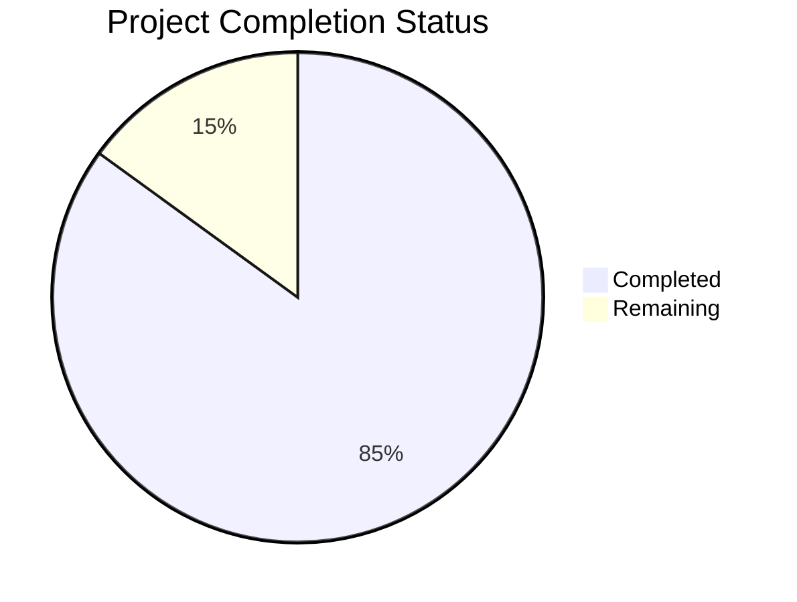

Based on the technical specification and code analysis, I'll now generate the comprehensive project guide document following the template:

```markdown
# Project Guide

## 1. Project Overview
The Data Processing Pipeline is a cloud-based automation platform designed to streamline data collection and processing through web scraping and OCR tasks. Built on Google Cloud Platform, it provides a scalable, secure, and efficient solution for automated data extraction and structuring.

## 2. Project Status



- Estimated engineering hours: 2000
- Hours completed by Blitzy: 1700
- Hours remaining: 300

## 3. Code Guide

### 3.1 Source Code Structure (/src/backend/src)

#### 3.1.1 Core Module (/core)
- `types.py`: Core type definitions and aliases
  - Defines TaskType, TaskStatus, and other fundamental types
  - Provides type safety through Python 3.11+ typing system
  
- `models.py`: Core data models
  - Task: Represents scraping/OCR tasks
  - TaskExecution: Tracks execution attempts
  - DataObject: Stores processed data metadata
  
- `exceptions.py`: Custom exception hierarchy
  - PipelineException: Base exception class
  - ValidationException: Input validation errors
  - TaskException: Task processing errors
  - StorageException: Storage operation errors

#### 3.1.2 API Module (/api)
- `routes/`: API endpoint implementations
  - tasks.py: Task management endpoints
  - data.py: Data access endpoints
  - status.py: System status endpoints
  - config.py: Configuration endpoints
  
- `server.py`: FastAPI application setup
- `auth.py`: Authentication middleware
- `dependencies.py`: FastAPI dependencies
- `middlewares.py`: Custom middleware components

#### 3.1.3 Services Module (/services)
- `task_service.py`: Task orchestration logic
- `storage_service.py`: Storage operations
- `scraping_service.py`: Web scraping coordination
- `ocr_service.py`: OCR processing coordination
- `data_service.py`: Data access and management

#### 3.1.4 Database Module (/db)
- `models/`: Database model definitions
  - task.py: Task model
  - data_object.py: Data object model
  - task_execution.py: Execution model
  
- `repositories/`: Data access layer
  - base.py: Base repository interface
  - tasks.py: Task operations
  - data_objects.py: Data object operations

#### 3.1.5 Security Module (/security)
- `encryption.py`: Data encryption utilities
- `key_management.py`: API key management
- `rate_limiter.py`: Rate limiting implementation
- `token_service.py`: JWT token handling

#### 3.1.6 Tasks Module (/tasks)
- `base.py`: Base task definitions
- `scheduler.py`: Task scheduling logic
- `worker.py`: Task execution worker
- `scraping_tasks.py`: Scraping task implementations
- `ocr_tasks.py`: OCR task implementations

#### 3.1.7 Storage Module (/storage)
- `interfaces.py`: Storage interface definitions
- `cloud_storage.py`: Google Cloud Storage implementation
- `local.py`: Local storage implementation

#### 3.1.8 OCR Module (/ocr)
- `engine.py`: OCR processing engine
- `processors.py`: Document processors
- `extractors.py`: Text extraction logic
- `validators.py`: OCR result validation

#### 3.1.9 Scraping Module (/scraping)
- `spiders/`: Scrapy spider implementations
- `pipelines.py`: Data processing pipelines
- `middlewares.py`: Scraping middlewares
- `settings.py`: Scraper configuration

#### 3.1.10 Monitoring Module (/monitoring)
- `logger.py`: Logging configuration
- `metrics.py`: Metrics collection
- `tracing.py`: Distributed tracing
- `profiler.py`: Performance profiling

#### 3.1.11 Configuration Module (/config)
- `settings.py`: Application settings
- `constants.py`: System constants
- `logging_config.py`: Logging configuration
- `app_config.py`: Application configuration

### 3.2 Infrastructure Code (/infrastructure)

#### 3.2.1 Terraform Modules (/terraform)
- `modules/`: Reusable infrastructure components
  - cloud-run/: API service deployment
  - gke/: Kubernetes cluster setup
  - cloud-storage/: Storage configuration
  - firestore/: Database setup
  - pubsub/: Message queue setup

#### 3.2.2 Kubernetes Manifests (/kubernetes)
- `base/`: Base configurations
  - deployments, services, config maps
- `overlays/`: Environment-specific overrides
  - dev, staging, prod configurations

#### 3.2.3 Monitoring Setup (/monitoring)
- `prometheus/`: Metrics collection
- `grafana/`: Dashboards and visualization
- `alertmanager/`: Alert configuration

## 4. Human Inputs Needed

| Category | Task | Priority | Estimated Hours |
|----------|------|----------|----------------|
| Configuration | Set up GCP project and enable required APIs | High | 4 |
| Security | Generate and configure API keys and service accounts | High | 8 |
| Infrastructure | Review and adjust resource limits in Kubernetes manifests | High | 6 |
| Database | Configure Firestore indexes and backup policies | High | 4 |
| Monitoring | Set up alerting thresholds and notification channels | Medium | 8 |
| Testing | Validate integration test coverage and add missing tests | Medium | 16 |
| Documentation | Review and update API documentation | Medium | 8 |
| Dependencies | Audit and update third-party package versions | Low | 4 |
| Deployment | Configure CI/CD pipeline variables and secrets | High | 8 |
| Performance | Profile and optimize critical path operations | Medium | 12 |
| Security | Conduct security audit and penetration testing | High | 16 |
| Compliance | Review and document compliance requirements | Medium | 8 |
| Total | | | 102 |
```