# Technical Specifications

# 1. INTRODUCTION

## 1.1 Executive Summary

The Data Processing Pipeline is a cloud-based automation platform designed to streamline the collection, processing, and structuring of data from web scraping and OCR tasks. The system addresses the critical business need for programmatic access to structured datasets by eliminating manual data collection processes and providing reliable, scalable data processing capabilities. Primary stakeholders include developers, data engineers, and data scientists who require consistent access to structured data for analysis and integration purposes. The platform delivers significant value through automated data collection, standardized processing workflows, and API-based data access, enabling organizations to efficiently scale their data operations.

## 1.2 System Overview

### Project Context

| Aspect | Description |
|--------|-------------|
| Business Context | Backend service supporting data-driven operations and analytics |
| Market Position | Infrastructure component enabling programmatic data access |
| Current Limitations | Manual data collection processes, inconsistent data structures |
| Enterprise Integration | Standalone service with API-based integration capabilities |

### High-Level Description

The system implements a modular architecture centered on:
- Python-based web scraping framework
- OCR processing engine for document extraction
- Google Cloud Storage for data persistence
- RESTful APIs for system interaction
- Task scheduling and monitoring capabilities

### Success Criteria

| Category | Metrics |
|----------|---------|
| Performance | - 99.9% system uptime<br>- Sub-500ms API response time<br>- 100+ pages/minute scraping throughput |
| Quality | - 98% data accuracy<br>- <0.1% error rate<br>- 100% data validation coverage |
| Business Impact | - 80% reduction in manual data collection<br>- 24-hour data freshness<br>- 100% programmatic data access |

## 1.3 Scope

### In-Scope Elements

| Category | Components |
|----------|------------|
| Core Features | - Automated web scraping<br>- PDF OCR processing<br>- Structured data storage<br>- RESTful API access |
| Implementation | - Task scheduling system<br>- Error handling framework<br>- Monitoring and logging<br>- Security controls |
| User Groups | - Data engineers<br>- Developers<br>- Data scientists |
| Data Domains | - Web-scraped content<br>- PDF documents<br>- Structured datasets |

### Out-of-Scope Elements

| Category | Exclusions |
|----------|------------|
| Features | - User interface development<br>- Data analysis tools<br>- Real-time streaming<br>- Custom reporting |
| Technical | - Direct database access<br>- Data transformation services<br>- Machine learning processing<br>- Mobile applications |
| Support | - End-user training<br>- Custom integrations<br>- Data analysis consulting<br>- Legacy system migration |

# 2. SYSTEM ARCHITECTURE

## 2.1 High-Level Architecture

```mermaid
C4Context
    title System Context Diagram (Level 0)

    Person(dev, "Developer", "System user consuming APIs")
    Person(dataEng, "Data Engineer", "Configures data pipelines")
    
    System_Boundary(pipeline, "Data Processing Pipeline") {
        System(api, "API Gateway", "Entry point for all system interactions")
        System(core, "Core Processing System", "Handles scraping and OCR tasks")
        System(storage, "Storage System", "Manages data persistence")
    }

    System_Ext(webSources, "Web Sources", "External websites and APIs")
    System_Ext(gcp, "Google Cloud Platform", "Cloud infrastructure provider")
    
    Rel(dev, api, "Uses REST API")
    Rel(dataEng, api, "Configures pipelines")
    Rel(core, webSources, "Scrapes data")
    Rel(pipeline, gcp, "Uses cloud services")
```

## 2.2 Container Architecture

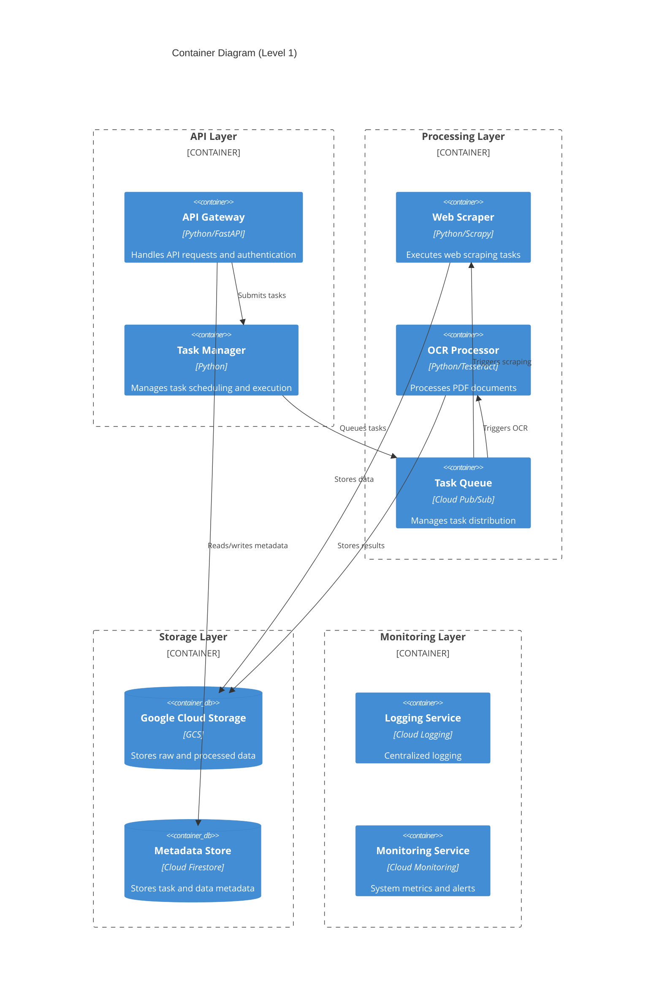

## 2.3 Component Details

### 2.3.1 API Gateway Component

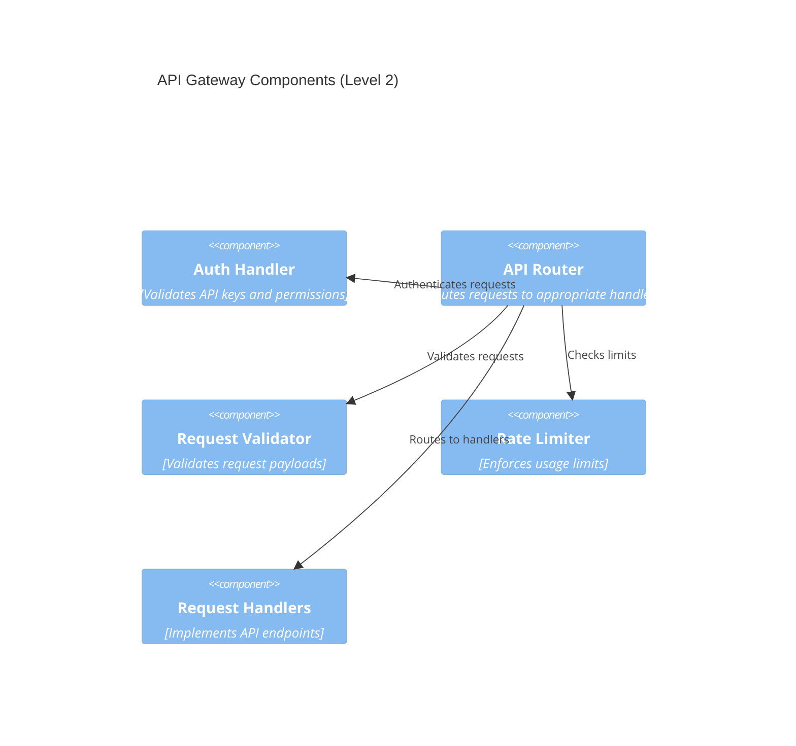

### 2.3.2 Data Flow Architecture

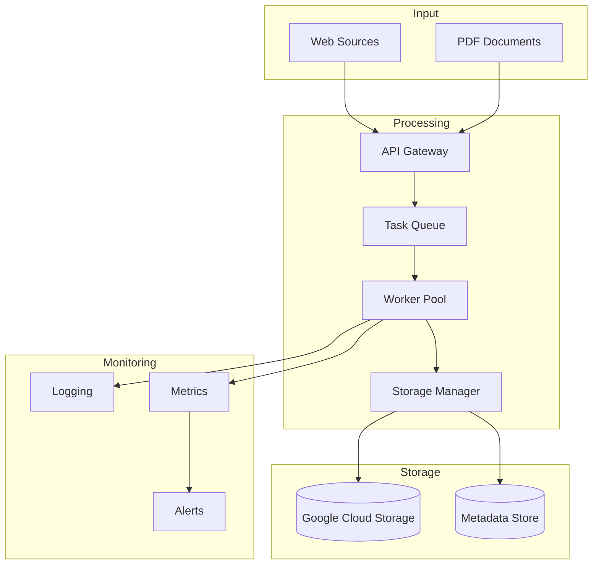

### 2.3.3 Deployment Architecture

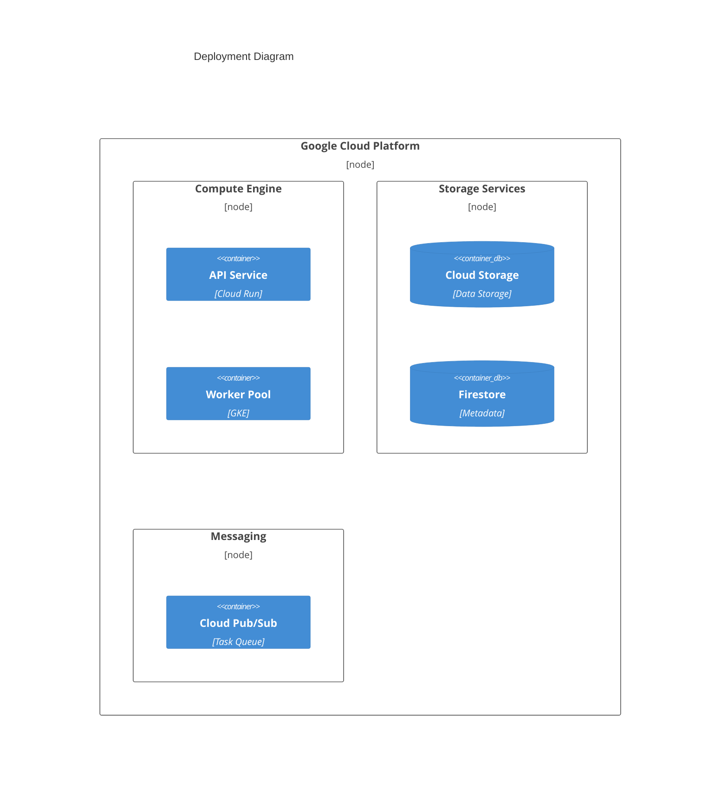

## 2.4 Technical Decisions

| Component | Technology Choice | Justification |
|-----------|------------------|---------------|
| API Framework | FastAPI | High performance, automatic OpenAPI docs, async support |
| Task Queue | Cloud Pub/Sub | Managed service, scalable, supports async patterns |
| Storage | Google Cloud Storage | Cost-effective, scalable, supports large files |
| Metadata Store | Cloud Firestore | Real-time updates, flexible schema, good querying |
| Container Orchestration | Google Kubernetes Engine | Scalability, automated management, resilience |

## 2.5 Cross-Cutting Concerns

### 2.5.1 Monitoring and Observability

| Aspect | Implementation | Tools |
|--------|----------------|-------|
| Metrics Collection | System and custom metrics | Cloud Monitoring |
| Logging | Structured JSON logs | Cloud Logging |
| Tracing | Distributed request tracing | Cloud Trace |
| Alerting | Metric-based alerts | Cloud Monitoring Alerting |

### 2.5.2 Security Architecture

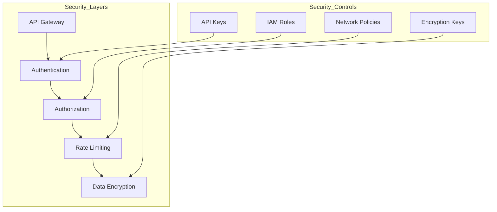

### 2.5.3 Error Handling Strategy

| Error Type | Handling Approach | Recovery Method |
|------------|------------------|-----------------|
| API Errors | HTTP status codes | Retry with backoff |
| Task Failures | Dead letter queue | Manual intervention |
| Storage Errors | Circuit breaker | Automatic failover |
| System Errors | Graceful degradation | Auto-healing |

### 2.5.4 Performance Requirements

| Metric | Target | Monitoring |
|--------|--------|------------|
| API Latency | <500ms p95 | Cloud Monitoring |
| Task Processing | <5min per task | Custom metrics |
| Storage I/O | >50MB/s | Storage metrics |
| Availability | 99.9% | Uptime checks |

# 3. SYSTEM COMPONENTS ARCHITECTURE

## 3.1 Command Line Interface Design

### 3.1.1 Command Structure

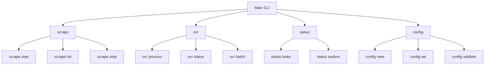

| Command Category | Format | Description |
|-----------------|---------|-------------|
| Scraping | `pipeline scrape [action] [options]` | Manage scraping tasks |
| OCR | `pipeline ocr [action] [options]` | Control OCR processing |
| Status | `pipeline status [resource]` | Monitor system status |
| Configuration | `pipeline config [action] [params]` | Manage system configuration |

### 3.1.2 Input/Output Specifications

| Aspect | Implementation | Example |
|--------|----------------|---------|
| Input Validation | JSON schema validation | `--config-file=config.json` |
| Output Formats | JSON, YAML, Table | `--output=json` |
| Error Messages | Structured error codes | `ERROR-001: Invalid configuration` |
| Progress Indicators | Progress bars, spinners | Loading animation during processing |
| Logging Levels | DEBUG, INFO, WARN, ERROR | `--log-level=DEBUG` |

## 3.2 Database Design

### 3.2.1 Schema Design

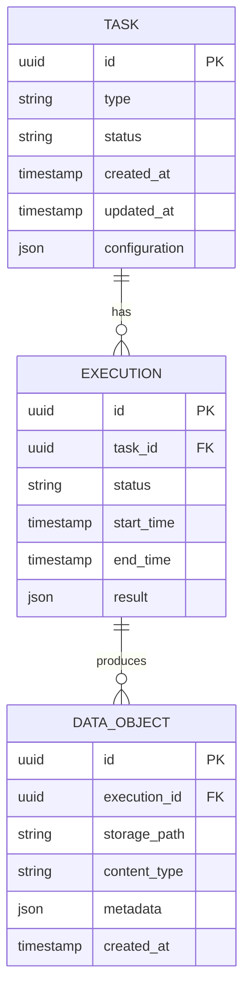

### 3.2.2 Data Management Strategy

| Aspect | Strategy | Implementation |
|--------|----------|----------------|
| Partitioning | Time-based partitioning | Monthly partitions for execution data |
| Indexing | Composite indexes | (task_id, status), (created_at, type) |
| Archival | Cold storage migration | Move data >90 days to archive |
| Backup | Daily incremental, weekly full | GCS bucket replication |
| Encryption | Server-side encryption | Google KMS integration |

### 3.2.3 Performance Optimization

| Component | Optimization | Implementation |
|-----------|-------------|----------------|
| Queries | Materialized views | Task status summaries |
| Caching | Redis cache | Task metadata, execution status |
| Scaling | Horizontal sharding | By task type and date range |
| Monitoring | Query performance tracking | Cloud Monitoring integration |

## 3.3 API Design

### 3.3.1 API Architecture

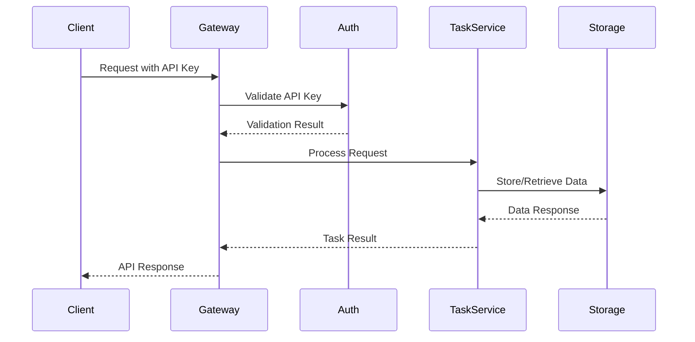

### 3.3.2 API Specifications

| Endpoint Category | Base Path | Authentication |
|------------------|-----------|----------------|
| Task Management | `/api/v1/tasks` | API Key |
| Data Retrieval | `/api/v1/data` | API Key + JWT |
| System Status | `/api/v1/status` | API Key |
| Configuration | `/api/v1/config` | API Key + Admin Role |

#### Request/Response Format

```yaml
# Task Creation Request
POST /api/v1/tasks
{
    "type": "scrape|ocr",
    "configuration": {
        "source": "string",
        "parameters": {}
    },
    "schedule": "cron_expression"
}

# Task Response
{
    "task_id": "uuid",
    "status": "pending|running|completed|failed",
    "created_at": "timestamp",
    "links": {
        "self": "/api/v1/tasks/{task_id}",
        "results": "/api/v1/tasks/{task_id}/results"
    }
}
```

### 3.3.3 Integration Specifications

| Integration Type | Implementation | Security |
|-----------------|----------------|-----------|
| Authentication | API Key + JWT | TLS 1.3 |
| Rate Limiting | Token bucket | 1000 req/hour |
| Circuit Breaker | Hystrix patterns | 50% error threshold |
| Monitoring | OpenTelemetry | Trace sampling 10% |
| Documentation | OpenAPI 3.0 | Auto-generated |

### 3.3.4 Error Handling

| Error Category | HTTP Status | Response Format |
|----------------|-------------|-----------------|
| Validation | 400 | `{"error": "validation_error", "details": {}}` |
| Authentication | 401 | `{"error": "unauthorized", "message": ""}` |
| Authorization | 403 | `{"error": "forbidden", "message": ""}` |
| Resource | 404 | `{"error": "not_found", "resource": ""}` |
| System | 500 | `{"error": "internal_error", "trace_id": ""}` |

### 3.3.5 Security Controls

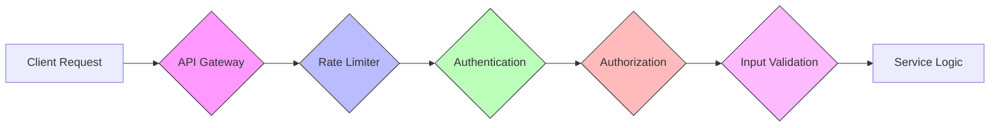

| Security Layer | Control | Implementation |
|----------------|---------|----------------|
| Transport | TLS 1.3 | Strict TLS configuration |
| Authentication | API Key + JWT | Key rotation every 90 days |
| Authorization | RBAC | Role-based permissions |
| Rate Limiting | Token Bucket | Per-client limits |
| Input Validation | JSON Schema | Request payload validation |
| Audit Logging | Structured Logs | Cloud Logging integration |

# 4. TECHNOLOGY STACK

## 4.1 PROGRAMMING LANGUAGES

| Component | Language | Version | Justification |
|-----------|----------|---------|---------------|
| Core Processing | Python | 3.11+ | - Extensive data processing libraries<br>- Strong web scraping ecosystem<br>- Native async support<br>- GCP SDK compatibility |
| Task Scheduling | Python | 3.11+ | - Consistent with core codebase<br>- Cloud Functions compatibility<br>- Rich scheduling libraries |
| OCR Processing | Python | 3.11+ | - Tesseract bindings availability<br>- Image processing libraries<br>- Memory management features |

## 4.2 FRAMEWORKS & LIBRARIES

### 4.2.1 Core Frameworks

| Framework | Version | Purpose | Justification |
|-----------|---------|---------|---------------|
| FastAPI | 0.100+ | API Framework | - High performance async support<br>- Automatic OpenAPI documentation<br>- Built-in validation |
| Scrapy | 2.9+ | Web Scraping | - Enterprise-grade scraping capabilities<br>- Extensive middleware support<br>- Built-in rate limiting |
| Tesseract | 4.1+ | OCR Engine | - Industry standard OCR<br>- Multiple language support<br>- Active maintenance |

### 4.2.2 Supporting Libraries

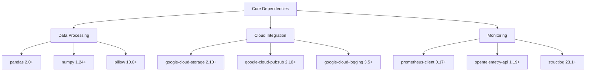

## 4.3 DATABASES & STORAGE

### 4.3.1 Storage Architecture

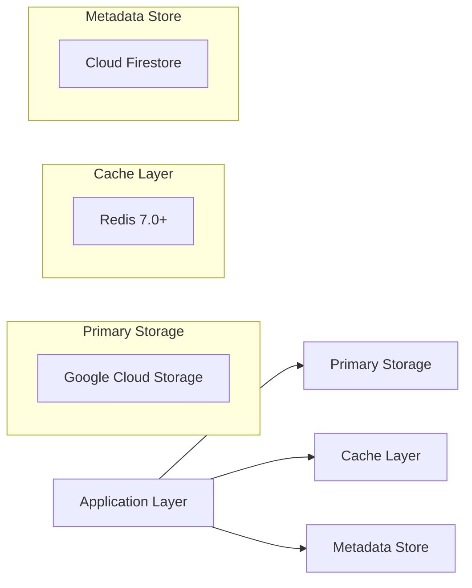

### 4.3.2 Storage Components

| Component | Technology | Purpose | Configuration |
|-----------|------------|---------|---------------|
| Object Storage | Google Cloud Storage | Raw data & files | - Standard storage class<br>- Regional redundancy<br>- Lifecycle management |
| Cache | Redis | Task status & metadata | - 6GB memory<br>- AOF persistence<br>- 3 node cluster |
| Document Store | Cloud Firestore | Task & system metadata | - Native mode<br>- Multi-region<br>- Automatic scaling |

## 4.4 THIRD-PARTY SERVICES

### 4.4.1 Service Dependencies

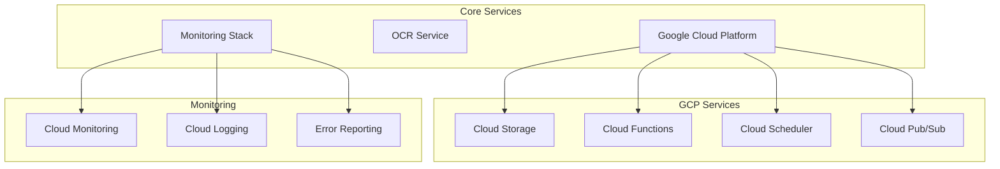

### 4.4.2 Service Matrix

| Service Category | Provider | Purpose | SLA |
|-----------------|----------|---------|-----|
| Cloud Infrastructure | Google Cloud Platform | Core infrastructure | 99.95% |
| OCR Processing | Google Cloud Vision API | Document processing | 99.9% |
| Monitoring | Google Cloud Operations | System observability | 99.99% |
| Error Tracking | Google Error Reporting | Error management | 99.95% |

## 4.5 DEVELOPMENT & DEPLOYMENT

### 4.5.1 Development Tools

| Category | Tool | Version | Purpose |
|----------|------|---------|---------|
| IDE | PyCharm Professional | 2023.2+ | Primary development |
| Code Quality | pylint | 2.17+ | Static analysis |
| Testing | pytest | 7.4+ | Unit & integration testing |
| API Testing | Postman | Latest | API development |

### 4.5.2 Deployment Pipeline

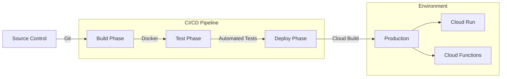

### 4.5.3 Container Configuration

| Component | Base Image | Size | Configuration |
|-----------|------------|------|---------------|
| API Service | python:3.11-slim | <500MB | - Multi-stage build<br>- Non-root user<br>- Health checks |
| Worker Service | python:3.11-slim | <800MB | - OCR dependencies<br>- Processing tools<br>- Memory limits |
| Scheduler | python:3.11-slim | <300MB | - Minimal dependencies<br>- Cron support<br>- Auto-scaling |

# 5. SYSTEM DESIGN

## 5.1 Command Line Interface Design

### 5.1.1 Command Structure

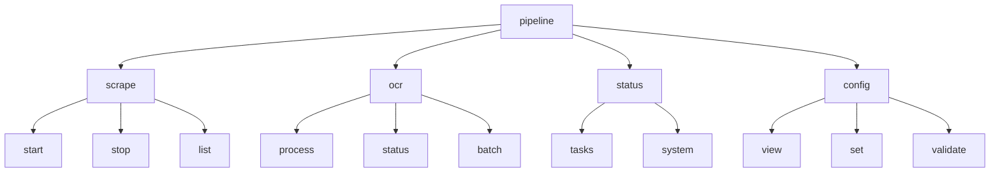

### 5.1.2 Command Reference

| Command | Syntax | Description | Example |
|---------|--------|-------------|---------|
| scrape start | `pipeline scrape start [source_id] [--config FILE]` | Initiates scraping task | `pipeline scrape start news-source --config scraper.yaml` |
| scrape stop | `pipeline scrape stop [task_id]` | Stops running task | `pipeline scrape stop task-123` |
| ocr process | `pipeline ocr process [file] [--output DIR]` | Process PDF file | `pipeline ocr process document.pdf --output ./results` |
| status tasks | `pipeline status tasks [--format json]` | Shows task status | `pipeline status tasks --format json` |
| config set | `pipeline config set [key] [value]` | Updates configuration | `pipeline config set api.rate_limit 1000` |

## 5.2 Database Design

### 5.2.1 Logical Data Model

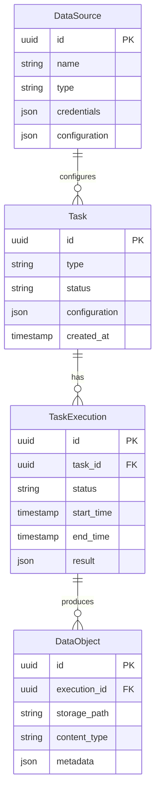

### 5.2.2 Storage Schema

| Collection | Purpose | Key Fields | Indexes |
|------------|---------|------------|---------|
| tasks | Task definitions | id, type, status | (type, status), (created_at) |
| executions | Task executions | id, task_id, status | (task_id, status), (start_time) |
| data_objects | Stored data references | id, execution_id | (execution_id), (storage_path) |
| data_sources | Source configurations | id, type | (type), (name) |

## 5.3 API Design

### 5.3.1 RESTful Endpoints

```mermaid
graph LR
    A[API Gateway] --> B[/tasks]
    A --> C[/data]
    A --> D[/status]
    A --> E[/config]
    
    B --> B1[POST /tasks]
    B --> B2[GET /tasks/{id}]
    B --> B3[DELETE /tasks/{id}]
    
    C --> C1[GET /data]
    C --> C2[GET /data/{id}]
    
    D --> D1[GET /status/tasks]
    D --> D2[GET /status/system]
    
    E --> E1[GET /config]
    E --> E2[PUT /config]
```

### 5.3.2 API Specifications

| Endpoint | Method | Request Body | Response | Description |
|----------|--------|--------------|----------|-------------|
| /tasks | POST | `{"type": "scrape\|ocr", "config": {}}` | Task object | Create new task |
| /tasks/{id} | GET | - | Task details | Get task status |
| /data | GET | - | Data object list | List available data |
| /status/system | GET | - | System metrics | Get system status |

### 5.3.3 Authentication Flow

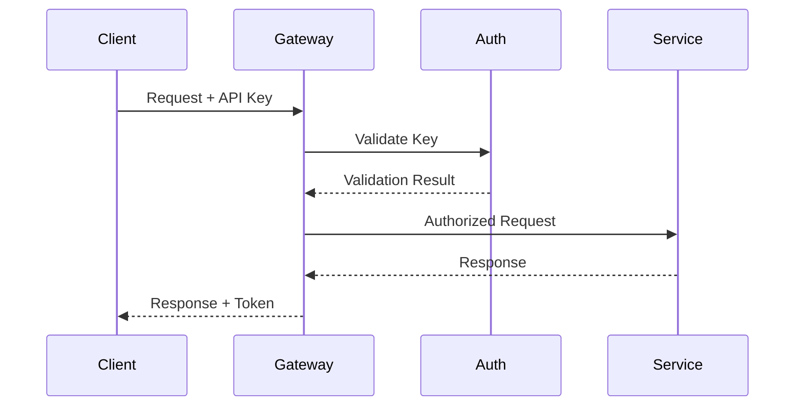

### 5.3.4 Error Responses

| Status Code | Error Type | Response Format |
|-------------|------------|-----------------|
| 400 | Bad Request | `{"error": "validation_error", "details": {}}` |
| 401 | Unauthorized | `{"error": "invalid_api_key"}` |
| 404 | Not Found | `{"error": "resource_not_found", "resource": ""}` |
| 429 | Rate Limited | `{"error": "rate_limit_exceeded", "retry_after": 0}` |
| 500 | Server Error | `{"error": "internal_error", "trace_id": ""}` |

## 5.4 Security Design

### 5.4.1 Authentication & Authorization

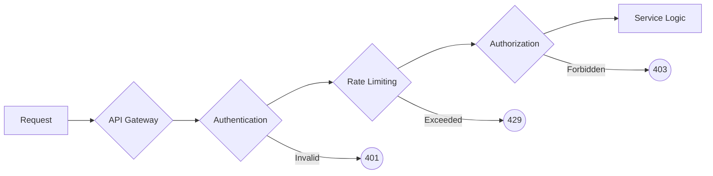

### 5.4.2 Security Controls

| Control Type | Implementation | Configuration |
|--------------|----------------|---------------|
| Authentication | API Key validation | Required for all endpoints |
| Rate Limiting | Token bucket algorithm | 1000 requests/hour |
| Data Encryption | AES-256-GCM | Server-side encryption |
| Access Control | Role-based (RBAC) | Defined in IAM |
| Audit Logging | Structured JSON logs | Retained for 90 days |

# 6. USER INTERFACE DESIGN

No user interface required. This system is designed as a backend service with API-only interactions as specified in the scope section 1.3 which explicitly lists user interface development as out of scope.

All system interactions should be performed through the documented REST APIs and command-line interface detailed in sections 3.3 and 5.1 respectively.

# 7. SECURITY CONSIDERATIONS

## 7.1 Authentication and Authorization

### 7.1.1 Authentication Flow

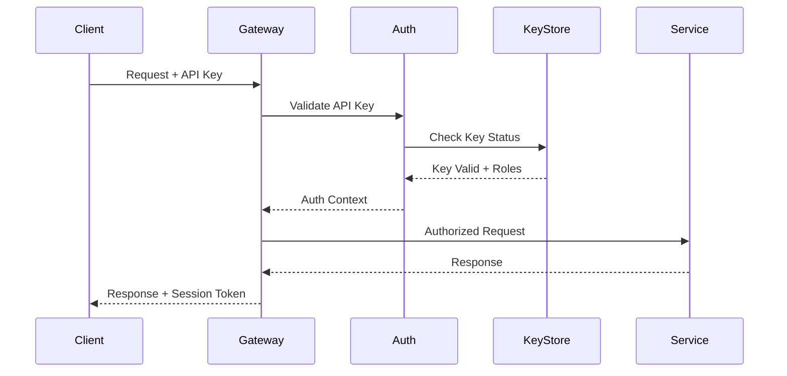

### 7.1.2 Authorization Matrix

| Role | Task Management | Data Access | Configuration | Monitoring |
|------|----------------|-------------|---------------|------------|
| Admin | Full Access | Full Access | Full Access | Full Access |
| Developer | Create, Read, Update | Read, Write | Read | Read |
| Analyst | Read | Read | No Access | Read |
| Service Account | Task Execution | Write | No Access | Write |

### 7.1.3 Access Control Implementation

| Component | Method | Implementation |
|-----------|--------|----------------|
| API Authentication | API Key | 256-bit keys with rotation |
| Service Authentication | Service Account | GCP IAM service accounts |
| Session Management | JWT Tokens | 1-hour expiration, refresh tokens |
| Role Management | RBAC | GCP IAM roles and permissions |

## 7.2 Data Security

### 7.2.1 Data Protection Layers

```mermaid
graph TD
    A[Data Entry] -->|TLS 1.3| B[Transport Layer]
    B -->|AES-256| C[Storage Layer]
    C -->|KMS| D[Encryption Layer]
    
    subgraph "Security Controls"
        E[Access Control]
        F[Audit Logging]
        G[Data Masking]
    end
    
    C --> E
    C --> F
    C --> G
```

### 7.2.2 Encryption Standards

| Data State | Encryption Method | Key Management |
|------------|------------------|----------------|
| In Transit | TLS 1.3 | Managed certificates |
| At Rest | AES-256-GCM | Cloud KMS |
| In Processing | Memory encryption | Secure enclave |
| Backups | AES-256-CBC | Customer managed keys |

### 7.2.3 Data Classification

| Classification | Description | Security Controls |
|----------------|-------------|-------------------|
| Public | Non-sensitive data | Basic encryption |
| Internal | Business data | Encryption + Access Control |
| Confidential | Sensitive business data | Full security stack + Audit |
| Restricted | Regulated data | Maximum security + DLP |

## 7.3 Security Protocols

### 7.3.1 Security Architecture

```mermaid
flowchart TB
    subgraph "Security Layers"
        A[Edge Security]
        B[Application Security]
        C[Data Security]
        D[Infrastructure Security]
    end
    
    subgraph "Controls"
        E[WAF]
        F[DDoS Protection]
        G[API Security]
        H[Identity Management]
        I[Encryption]
        J[Network Security]
    end
    
    A --> E
    A --> F
    B --> G
    B --> H
    C --> I
    D --> J
```

### 7.3.2 Security Monitoring

| Component | Monitoring Method | Alert Threshold |
|-----------|------------------|-----------------|
| API Gateway | Request pattern analysis | >100 failed auth attempts/min |
| Data Access | Audit log analysis | Unauthorized access attempts |
| Network | Traffic analysis | Abnormal traffic patterns |
| System | Resource monitoring | Suspicious resource usage |

### 7.3.3 Security Compliance

| Requirement | Implementation | Validation |
|-------------|----------------|------------|
| Access Logging | Cloud Audit Logs | Daily log analysis |
| Key Rotation | Automated 90-day rotation | Rotation verification |
| Vulnerability Scanning | Weekly automated scans | Scan report review |
| Security Updates | Automated patching | Update verification |
| Penetration Testing | Quarterly testing | Test report review |

### 7.3.4 Incident Response

| Phase | Actions | Responsibility |
|-------|---------|---------------|
| Detection | Monitor security alerts | Security Team |
| Analysis | Assess impact and scope | Security + DevOps |
| Containment | Isolate affected systems | DevOps Team |
| Eradication | Remove security threats | Security Team |
| Recovery | Restore normal operation | DevOps Team |
| Post-Incident | Review and improve | All Teams |

# 8. INFRASTRUCTURE

## 8.1 Deployment Environment

The Data Processing Pipeline is deployed entirely on Google Cloud Platform (GCP) to leverage its managed services, scalability, and integration capabilities.

| Environment | Purpose | Configuration |
|------------|---------|---------------|
| Development | Feature development and testing | - Single region (us-central1)<br>- Minimal redundancy<br>- Development-sized instances |
| Staging | Pre-production validation | - Single region (us-central1)<br>- Production-like setup<br>- Reduced capacity |
| Production | Live system operation | - Multi-region (us-central1, us-east1)<br>- Full redundancy<br>- Auto-scaling enabled |

## 8.2 Cloud Services

```mermaid
graph TB
    subgraph "Compute Services"
        A[Cloud Run] --> B[API Services]
        C[GKE] --> D[Worker Nodes]
    end
    
    subgraph "Storage Services"
        E[Cloud Storage] --> F[Data Lake]
        G[Cloud Firestore] --> H[Metadata]
    end
    
    subgraph "Supporting Services"
        I[Cloud Pub/Sub] --> J[Task Queue]
        K[Cloud KMS] --> L[Key Management]
        M[Cloud Monitoring] --> N[Observability]
    end
```

| Service | Usage | Justification |
|---------|-------|---------------|
| Cloud Run | API hosting | - Serverless scalability<br>- Pay-per-use pricing<br>- Native container support |
| GKE | Worker orchestration | - Managed Kubernetes<br>- Auto-scaling<br>- Container orchestration |
| Cloud Storage | Data persistence | - Scalable object storage<br>- Cost-effective<br>- High durability |
| Cloud Firestore | Metadata storage | - Real-time updates<br>- Document-based model<br>- Automatic scaling |
| Cloud Pub/Sub | Message queue | - Reliable messaging<br>- Async communication<br>- High throughput |

## 8.3 Containerization

### 8.3.1 Container Architecture

```mermaid
graph TD
    subgraph "Container Images"
        A[Base Image: python:3.11-slim]
        B[API Image]
        C[Worker Image]
        D[Scheduler Image]
        
        A --> B
        A --> C
        A --> D
    end
    
    subgraph "Container Registry"
        E[GCP Artifact Registry]
        
        B --> E
        C --> E
        D --> E
    end
```

### 8.3.2 Container Specifications

| Container | Base Image | Size Limit | Key Components |
|-----------|------------|------------|----------------|
| API | python:3.11-slim | 500MB | - FastAPI<br>- GCP clients<br>- Monitoring tools |
| Worker | python:3.11-slim | 800MB | - Scrapy<br>- Tesseract OCR<br>- Processing libraries |
| Scheduler | python:3.11-slim | 300MB | - Cloud Scheduler client<br>- Task management tools |

## 8.4 Orchestration

### 8.4.1 Kubernetes Architecture

```mermaid
graph TB
    subgraph "GKE Cluster"
        A[Ingress Controller]
        B[API Pods]
        C[Worker Pods]
        D[Scheduler Pods]
        
        A --> B
        A --> C
        A --> D
        
        E[HPA] --> B
        F[HPA] --> C
        
        G[ConfigMaps]
        H[Secrets]
    end
```

### 8.4.2 Kubernetes Resources

| Resource Type | Configuration | Scaling Policy |
|--------------|---------------|----------------|
| API Deployment | - 3 replicas min<br>- Resource limits<br>- Health checks | CPU usage > 70% |
| Worker Deployment | - 5 replicas min<br>- Resource limits<br>- Liveness probes | Queue length based |
| Scheduler Deployment | - 2 replicas<br>- Resource limits<br>- Readiness probes | Manual scaling |

## 8.5 CI/CD Pipeline

### 8.5.1 Pipeline Architecture

```mermaid
graph LR
    A[Source Code] -->|Git Push| B[Cloud Build]
    B -->|Unit Tests| C[Test Stage]
    C -->|Build Images| D[Build Stage]
    D -->|Deploy| E[Staging]
    E -->|Integration Tests| F[Validation]
    F -->|Promote| G[Production]
    
    H[Infrastructure Code] -->|Terraform| I[Infrastructure Stage]
    I -->|Apply| J[Environment Setup]
```

### 8.5.2 Pipeline Stages

| Stage | Tools | Actions | Success Criteria |
|-------|-------|---------|-----------------|
| Code Quality | - pylint<br>- black<br>- mypy | - Style checks<br>- Type checking<br>- Code analysis | All checks pass |
| Testing | - pytest<br>- coverage | - Unit tests<br>- Integration tests<br>- Coverage report | 80% coverage minimum |
| Build | - Docker<br>- Cloud Build | - Image building<br>- Vulnerability scanning<br>- Image tagging | No critical vulnerabilities |
| Deploy | - Kubernetes<br>- Terraform | - Infrastructure updates<br>- Application deployment<br>- Configuration updates | Zero downtime deployment |
| Validation | - Postman<br>- k6 | - API testing<br>- Load testing<br>- Smoke tests | All tests passing |

### 8.5.3 Deployment Strategy

```mermaid
graph TD
    A[New Version] -->|Rolling Update| B{Health Check}
    B -->|Pass| C[Continue Rollout]
    B -->|Fail| D[Rollback]
    
    C -->|Complete| E[Update DNS]
    D -->|Revert| F[Previous Version]
    
    G[Monitoring] --> B
```

| Strategy | Implementation | Rollback Time |
|----------|---------------|---------------|
| Rolling Update | Progressive pod replacement | < 5 minutes |
| Blue-Green | Parallel environment swap | < 2 minutes |
| Canary | 10% traffic to new version | < 1 minute |

# 9. APPENDICES

## 9.1 Additional Technical Information

### 9.1.1 Error Code Reference

| Error Code | Description | Resolution |
|------------|-------------|------------|
| ERR-001 | API Authentication Failed | Verify API key validity and permissions |
| ERR-002 | Rate Limit Exceeded | Reduce request frequency or upgrade tier |
| ERR-003 | Invalid Task Configuration | Review task configuration against schema |
| ERR-004 | Storage Operation Failed | Check GCS permissions and quota |
| ERR-005 | OCR Processing Error | Verify PDF quality and format |
| ERR-006 | Scraping Target Unreachable | Check target site availability |

### 9.1.2 System Health Metrics

```mermaid
graph TD
    A[System Health] --> B[Performance Metrics]
    A --> C[Resource Utilization]
    A --> D[Error Rates]
    
    B --> B1[API Latency]
    B --> B2[Processing Time]
    B --> B3[Storage I/O]
    
    C --> C1[CPU Usage]
    C --> C2[Memory Usage]
    C --> C3[Network Bandwidth]
    
    D --> D1[API Errors]
    D --> D2[Task Failures]
    D --> D3[Storage Errors]
```

## 9.2 GLOSSARY

| Term | Definition |
|------|------------|
| Dead Letter Queue | Storage location for messages that cannot be processed successfully |
| Edge Case | Unusual or extreme situation that requires special handling |
| Graceful Degradation | System's ability to maintain limited functionality during partial failures |
| Idempotency | Property where an operation produces the same result regardless of how many times it's performed |
| Payload | The actual data portion of a transmitted message |
| Throttling | Controlling the rate of resource usage or request processing |
| Time Series Data | Data points indexed in time order |
| Webhook | HTTP callback that occurs when something happens |
| Worker Pool | Collection of processes that handle distributed tasks |
| Zero Downtime Deployment | Deployment strategy that ensures continuous service availability |

## 9.3 ACRONYMS

| Acronym | Full Form |
|---------|-----------|
| AES | Advanced Encryption Standard |
| API | Application Programming Interface |
| CPU | Central Processing Unit |
| CSV | Comma-Separated Values |
| DLQ | Dead Letter Queue |
| DNS | Domain Name System |
| GCP | Google Cloud Platform |
| GCS | Google Cloud Storage |
| HMAC | Hash-based Message Authentication Code |
| HTML | Hypertext Markup Language |
| HTTP | Hypertext Transfer Protocol |
| HTTPS | Hypertext Transfer Protocol Secure |
| IAM | Identity and Access Management |
| I/O | Input/Output |
| JSON | JavaScript Object Notation |
| JWT | JSON Web Token |
| KMS | Key Management Service |
| OCR | Optical Character Recognition |
| PDF | Portable Document Format |
| RAM | Random Access Memory |
| REST | Representational State Transfer |
| RFC | Request for Comments |
| SLA | Service Level Agreement |
| SSL | Secure Sockets Layer |
| TLS | Transport Layer Security |
| URL | Uniform Resource Locator |
| UUID | Universally Unique Identifier |
| XML | Extensible Markup Language |
| YAML | YAML Ain't Markup Language |

## 9.4 Configuration Examples

### 9.4.1 Task Configuration Template

```yaml
task:
  id: "task-${UUID}"
  type: "scrape|ocr"
  schedule: "cron_expression"
  retry_policy:
    max_attempts: 3
    backoff_multiplier: 2
    initial_delay_ms: 1000
  resources:
    cpu_limit: "1.0"
    memory_limit: "2Gi"
    timeout_seconds: 300
```

### 9.4.2 Monitoring Configuration

```yaml
monitoring:
  metrics:
    collection_interval: 60
    retention_days: 30
  alerts:
    error_rate_threshold: 0.01
    latency_threshold_ms: 500
    resource_utilization_threshold: 0.8
  logging:
    level: "INFO"
    retention_days: 90
    structured: true
```

### 9.4.3 Security Configuration

```yaml
security:
  api_keys:
    rotation_days: 90
    length: 32
  encryption:
    algorithm: "AES-256-GCM"
    key_rotation_period: "30d"
  rate_limiting:
    window_size: "1h"
    max_requests: 1000
```