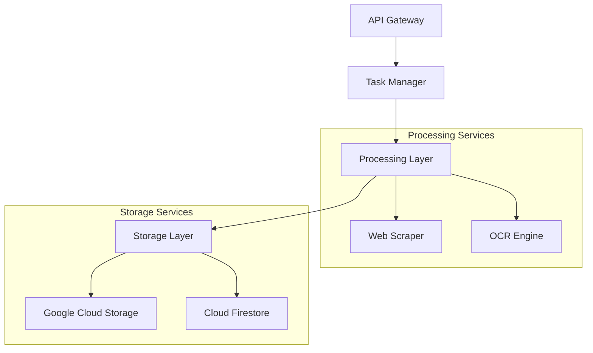

# Data Processing Pipeline Backend Service

[](https://www.python.org/downloads/)
[](https://fastapi.tiangolo.com/)
[](https://github.com/psf/black)
[](https://opensource.org/licenses/MIT)

A cloud-based automation platform designed for streamlined data collection, processing, and structuring from web scraping and OCR tasks.

## Table of Contents

- [Overview](#overview)
- [Prerequisites](#prerequisites)
- [Getting Started](#getting-started)
- [Development](#development)
- [API Documentation](#api-documentation)
- [Deployment](#deployment)
- [Security](#security)
- [Contributing](#contributing)

## Overview

### Architecture

The Data Processing Pipeline is built on a containerized microservices architecture leveraging Google Cloud Platform services:



### Key Features

- **Web Scraping Engine**: High-performance scraping with rate limiting and proxy support
- **OCR Processing**: Document text extraction with Tesseract integration
- **Task Management**: Distributed task scheduling and monitoring
- **Data Storage**: Scalable cloud storage with metadata management
- **API Access**: RESTful API with comprehensive documentation
- **Security**: Enterprise-grade authentication and encryption

### Performance Characteristics

- API Response Time: <500ms (p95)
- Processing Throughput: 100+ pages/minute
- Storage I/O: >50MB/s
- System Uptime: 99.9%

## Prerequisites

### System Requirements

- Python 3.11 or higher
- Docker 20.10.x or higher
- Docker Compose 2.x
- 4GB RAM minimum
- 10GB free disk space

### GCP Account Setup

1. Create a GCP project
2. Enable required APIs:
   ```bash
   gcloud services enable \
       compute.googleapis.com \
       container.googleapis.com \
       cloudbuild.googleapis.com \
       storage.googleapis.com \
       firestore.googleapis.com \
       pubsub.googleapis.com
   ```

3. Configure authentication:
   ```bash
   gcloud auth application-default login
   ```

### Development Tools

```bash
# Install development dependencies
pip install -r requirements-dev.txt

# Install pre-commit hooks
pre-commit install
```

## Getting Started

### Installation

1. Clone the repository:
   ```bash
   git clone <repository-url>
   cd src/backend
   ```

2. Create and configure environment:
   ```bash
   cp .env.example .env
   # Edit .env with your configuration
   ```

3. Install dependencies:
   ```bash
   pip install -r requirements.txt
   ```

4. Start development services:
   ```bash
   docker-compose up -d
   ```

### Verification

```bash
# Run tests
pytest

# Check API health
curl http://localhost:8000/health

# Verify worker status
docker-compose ps
```

## Development

### Local Environment

```bash
# Start development server
uvicorn app.main:app --reload

# Run worker process
celery -A app.worker worker --loglevel=info

# Start scheduler
celery -A app.worker beat --loglevel=info
```

### Testing

```bash
# Run unit tests
pytest tests/unit

# Run integration tests
pytest tests/integration

# Generate coverage report
pytest --cov=app tests/
```

### Code Style

```bash
# Format code
black .

# Lint code
pylint app/

# Type checking
mypy app/
```

## API Documentation

### Authentication

```python
# API Key authentication
headers = {
    "X-API-Key": "your-api-key"
}

# JWT authentication (after login)
headers = {
    "Authorization": f"Bearer {token}"
}
```

### Example Requests

```python
# Create scraping task
POST /api/v1/tasks
{
    "type": "scrape",
    "config": {
        "url": "https://example.com",
        "selectors": {
            "title": "h1",
            "content": "article"
        }
    }
}

# Process PDF document
POST /api/v1/tasks
{
    "type": "ocr",
    "config": {
        "storage_path": "documents/sample.pdf",
        "language": "eng"
    }
}
```

## Deployment

### Container Images

```bash
# Build images
docker-compose build

# Push to registry
docker-compose push
```

### GCP Deployment

```bash
# Deploy to Cloud Run
gcloud run deploy api-service \
    --image gcr.io/project-id/api-service \
    --platform managed \
    --region us-central1 \
    --allow-unauthenticated

# Deploy worker to GKE
kubectl apply -f k8s/worker-deployment.yaml
```

### Configuration Management

```yaml
# config/production.yaml
api:
  host: 0.0.0.0
  port: 8000
  workers: 4
  
worker:
  concurrency: 10
  task_timeout: 300
  
storage:
  bucket: production-data
  region: us-central1
```

## Security

### Best Practices

- Use strong API keys (min 32 characters)
- Rotate credentials every 90 days
- Enable audit logging
- Implement rate limiting
- Use TLS 1.3 for all connections
- Regular security scanning

### Environment Configuration

```bash
# Security-related environment variables
API_KEY_SALT=<random-32-char-string>
JWT_SECRET_KEY=<random-32-char-string>
ENCRYPTION_KEY=<random-32-char-string>
GCP_KMS_KEY_RING=production
GCP_KMS_KEY_NAME=data-encryption-key
```

## Contributing

### Development Workflow

1. Create feature branch
2. Implement changes
3. Add tests
4. Update documentation
5. Submit pull request

### Code Review Process

- Two approvals required
- All tests must pass
- Coverage must not decrease
- Documentation must be updated

---

## Last Updated

Date: 2024-01-20
Version: 1.0.0

## Maintainers

- Development Team
- DevOps Team

For additional support, please contact the development team.